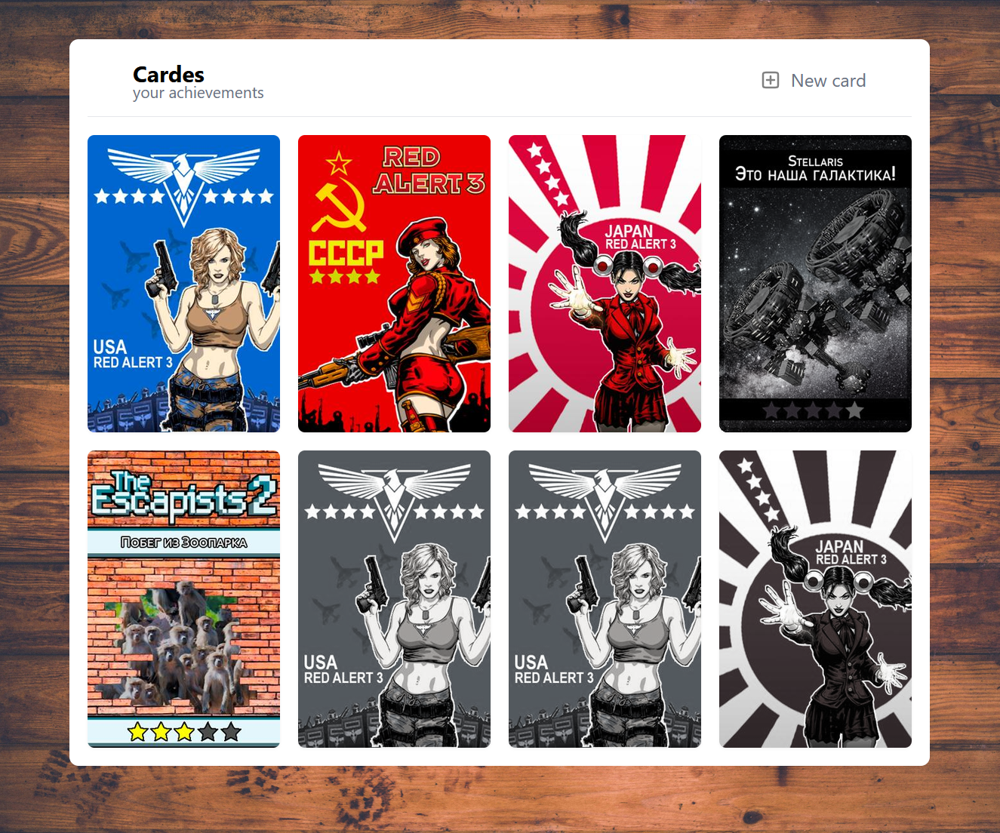
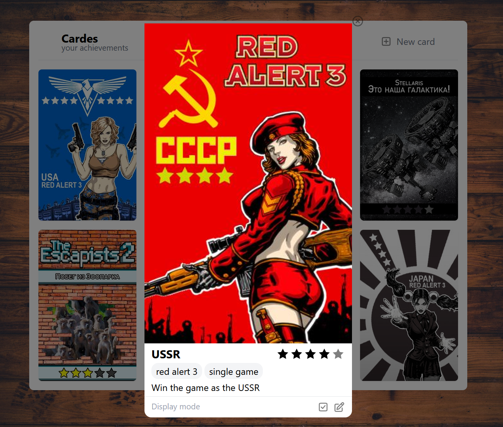
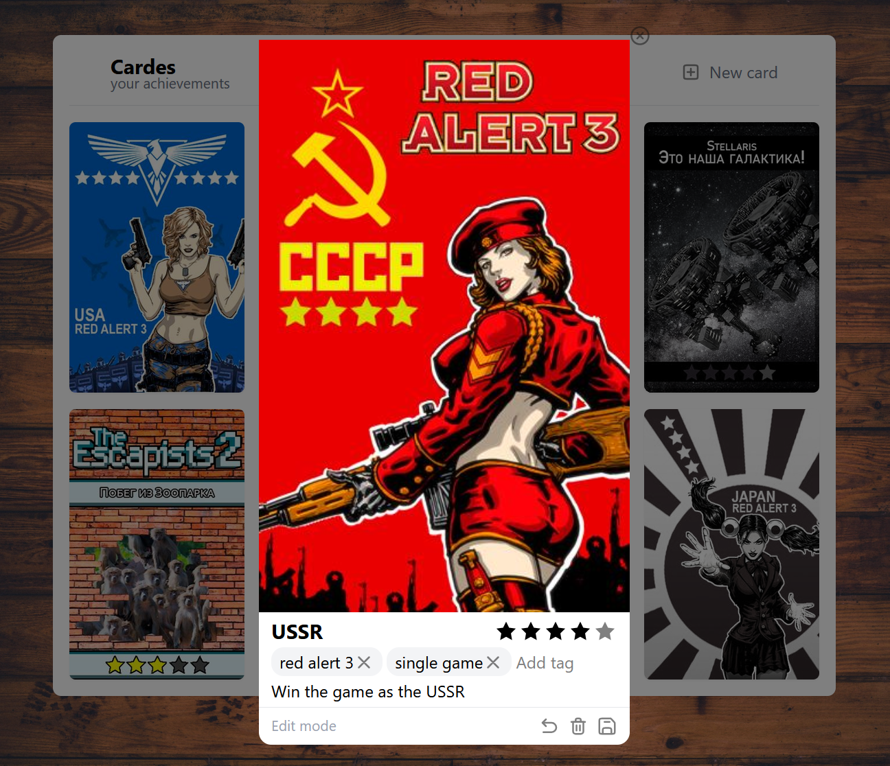

## Что это

**Cardes** — это приложение для управления коллекцией интерактивных карточек. Создавал для себя и друзей, чтобы делать достижения для нас же.

## Запуск проекта

### Запуск сервера
```bash
cd server
docker compose up
poetry run dev
```

### Запуск клиента
```bash
cd client
npm run dev
```

## Интерфейс программы

### Главный экран
Отображает всю коллекцию карт. На каждую можно нажать и перейти в режим просмотра.



---

### Режим просмотра
Позволяет изучить карточку в высоком качестве с подробным описанием. Здесь же можно менять статус (выполнено/невыполнено) — при этом карточка визуально меняет свой контраст.



---

### Режим редактирования
Позволяет изменить описание, название, тэги, сложность и картинку. В общем все что есть у карточки.

